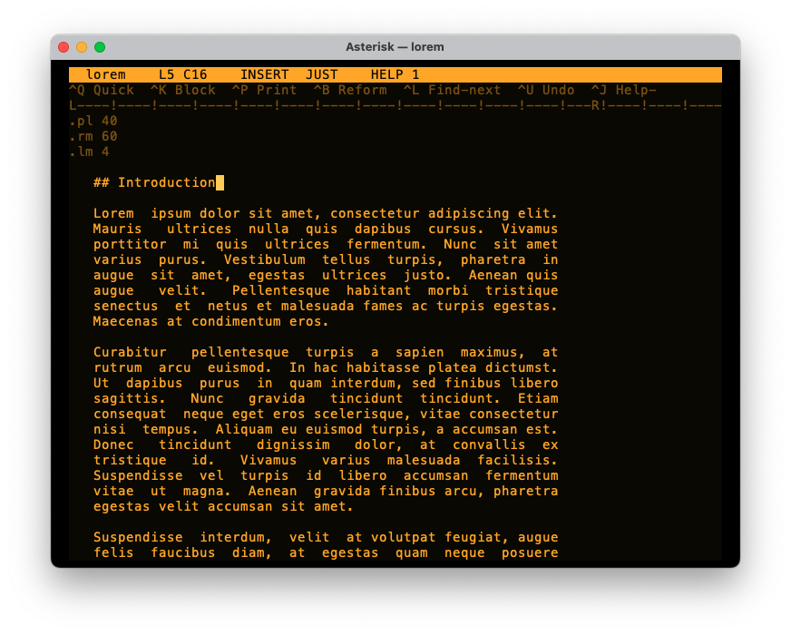

# Asterisk

**Asterisk** is a native macOS word processor inspired by DOS WordStar 4.0 —
authentic text-mode screen, WordStar control-key commands, built for blindly fast
text input. (Repository name: `WordStarMac`; the shipped app is **Asterisk**.)

Swift + AppKit, custom `NSView` cell-grid renderer (no Electron, no TextKit).

> **Name & trademarks.** Asterisk is an independent, clean-room tribute. It is
> not affiliated with, endorsed by, or derived from the source code of any owner
> of the "WordStar" trademark; that name is used here only to describe the
> historical software this project pays homage to.



## Install

Requires macOS 12+ and the Xcode Command Line Tools (`xcode-select --install`) —
no full Xcode needed. Swift 5.x toolchain.

### Run from source

```sh
git clone https://github.com/russellashby/asterisk.git
cd asterisk
swift run WordStarMac    # build + launch  (SwiftPM target name)
swift run WSCoreTests    # run the core unit tests
```

### Build a double-clickable app

```sh
./bundle.sh              # produces Asterisk.app
open Asterisk.app
```

> **First launch (Gatekeeper).** Release builds are **not code-signed**, so macOS
> will say *"Asterisk can't be opened because Apple cannot check it for malicious
> software."* This is expected for an unsigned open-source app. Either:
> - **right-click the app → Open**, then confirm **Open** in the dialog (only
>   needed once), or
> - clear the quarantine flag: `xattr -dr com.apple.quarantine Asterisk.app`.
>
> If you'd rather avoid this entirely, just run from source with `swift run`.

### Keys (so far)

| Action | Keys |
|--------|------|
| Cursor | arrows · `^E`/`^X`/`^S`/`^D` (diamond) |
| Word left / right | `^A` / `^F` |
| Page up / down | `^R` / `^C` · PgUp/PgDn |
| Line start / end | Home / End |
| Delete char under cursor / word / line | `^G` / `^T` / `^Y` |
| Insert / overtype toggle | `^V` |
| Undo · find next | `^U` · `^L` |
| **Block** (`^K`) begin/end · copy · move · delete · hide | `^KB`/`^KK` · `^KC` · `^KV` · `^KY` · `^KH` |
| **Quick** (`^Q`) line start/end · doc top/bottom | `^QS`/`^QD` · `^QR`/`^QC` |
| **Quick** find · replace · to block · del-to-eol | `^QF` · `^QA` · `^QB`/`^QK` · `^QY` |
| **Print** (`^P`) bold · underline · italic | `^PB` · `^PS` · `^PY` |
| **Onscreen** (`^O`) justify on/off | `^OJ` |
| **Dot commands** margins · page breaks | `.lm`/`.rm` · `.pa`/`.pl`/`.mt`/`.mb` |
| Reform paragraph · cycle help level | `^B` · `^J` |
| **File** (`^K`) save · read/open | `^KS` · `^KR` |
| Native menu: New/Open/Save/Save As | `⌘N` `⌘O` `⌘S` `⌘⇧S` |
| Native menu: Undo/Redo · Cut/Copy/Paste | `⌘Z` `⌘⇧Z` · `⌘X` `⌘C` `⌘V` |
| Native menu: Find/Find-next/Replace | `⌘F` `⌘G` `⌘R` |
| Quit | `⌘Q` |

## Roadmap / backlog

- CP437 bitmap font (DOS glyphs). _(CRT glow/scanlines done — View menu.)_
- Palette switching UI + fuller native menu mirroring.
- Remaining commands: `^QE`/`^QX`, more `^O` onscreen options (`^OC` center,
  `^OS` line spacing), `^P` print/PDF pipeline.

## Layout

| File             | Responsibility                                  |
|------------------|-------------------------------------------------|
| `main.swift`     | NSApplication entry point                        |
| `AppDelegate.swift` | Window + menu setup                          |
| `EditorView.swift`  | Input, geometry, render-to-grid, drawing     |
| `CellGrid.swift`    | Cell model + grid buffer (diffable)          |
| `TextModel.swift`   | Phase 1 line buffer (piece table comes next) |
| `Theme.swift`       | Role-based colour palette                     |
